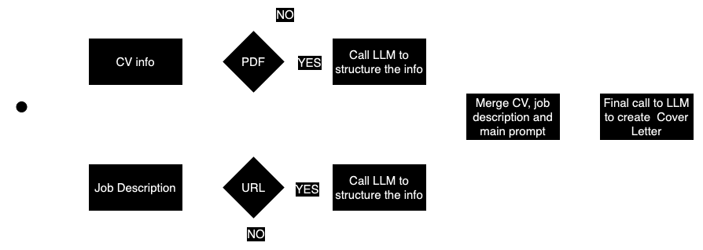

# Automatic cover letter generator
Simple app for generating cover letter based on CV and job description
In order to use the app, please provider a valid OpenAI API key. Another note, generating cover letter could take some time(1-2 minutes) because of multiple requests per one cover letter generation. 

# How it works
The overall app is very simple, but straightforward. Code structured in a modular way, making it very easy to extend the app to new use-case or improving it.
All prompts stored in a separate file called `prompts.py` in `utils` folder.
   

   
Solution flow

   

   

# How to use solution 
### Online Demo 
You can simply use the Gradio demo [here](https://huggingface.co/spaces/random-alex1/cover-letter)

### Locally (CLI)
1. Install the dependencies:
   
   `pip install -r requirements.txt`
2. Create a file called `gpt_api.py` under `utils` folder with variable `GPT_API_KEY = "correct_openai_key"`
3. Run the command:
   
    `python main.py --cv=test_assets/cvs/test_cv1.pdf --job_description='https://www.linkedin.com/jobs/view/3793239233/?alternateChannel=search&refId=9LsNBvo7h3zfuWe5C98kwQ%3D%3D&trackingId=LJyOI1ULOamcnhv9V6KXsw%3D%3D' --is_pdf_cv --is_url_jd`
### Locally (Gradio demo)
1. Install the dependencies:
   
   `pip install -r requirements.txt`
2. Run the command:
    
    `python app.py`

# Examples of generated cover letters
For all examples below I used my own CV as a candidate's CV to make sure everything is GDPR-compliant.
1. [Senior Machine Learning Engineer (NLP & GenAI) to Vestas AI CoE](https://www.linkedin.com/jobs/view/3802469758/?alternateChannel=search&refId=taHPSYQFILhmi%2FobI5yXHg%3D%3D&trackingId=Q1R2s0Pis5%2FsFIdHPS6%2BHQ%3D%3D)
   

   
Resulting cover letter

   Dear Ravi Bedadi,
   
   I am writing to express my keen interest in the Senior Machine Learning Engineer (NLP & GenAI) position at Vestas AI CoE, as advertised. With a solid foundation in applied mathematics and engineering, complemented by extensive professional experience in machine learning, data engineering, and specifically NLP, I am excited about the opportunity to contribute to Vestas' mission to accelerate business value through innovative AI solutions.
   
   My academic background includes a Master's degree in Applied Mathematics from HSE and a Bachelor's degree in Engineering from BMSTU. These programs equipped me with a deep understanding of optimisation algorithms, statistics, and programming, which have been fundamental to my success in the field. My professional journey has seen me advance from a Data Analysis Specialist to a Lead Machine Learning Engineer, where I currently oversee a team at Neurons Inc, ensuring the delivery of state-of-the-art model predictions and the maintenance of MLOps and LLMOps practices.
   
   At ThePlatypus, I built the core algorithm for an HRtech startup platform, engaging in NLP and R&D work, and delivering end-to-end machine learning models. This hands-on experience with NLP and my subsequent leadership role have honed my skills in developing and productizing ML algorithms, aligning perfectly with the responsibilities outlined for the role at Vestas.
   
   My technical skills are a strong match for the qualifications sought by Vestas. I am proficient in Python, R, Golang, and SQL, and have extensive experience with technologies and tools such as TensorFlow, PyTorch, Keras, scikit-learn, LangChain, LlamaIndex, and cloud platforms. Although my experience with cloud deployment has been primarily with GCP, I am confident in my ability to adapt to Azure and have a proven track record of deploying solutions with CI/CD practices.
   
   I am particularly drawn to Vestas' commitment to impacting climate change and fostering a diverse and inclusive workplace. I am eager to bring my entrepreneurial spirit, technical vision, and collaborative drive to a team of senior data scientists and ML engineers. I am passionate about continuous learning and staying abreast of the latest advancements in the field, which I believe will be an asset to the AI CoE at Vestas.
   
   I am fluent in English and possess strong communication skills, which I have leveraged to collaborate closely with both business and technology functions. My experience in managing and mentoring teams aligns with the expectation of contributing to the AI CoE's organizational and cultural development.
   
   I am excited about the opportunity to shape the role within the AI CoE and to be part of a global leader in sustainable energy solutions. I am looking forward to the possibility of discussing how my background, skills, and enthusiasms can be in alignment with the innovative work being done at Vestas.
   
   Thank you for considering my application. I am available at your earliest convenience for an interview and can be reached at aleksei.zotov.ml@gmail.com or via my GitHub at github.com/random-alex. I am looking forward to the opportunity to further discuss how I can contribute to Vestas AI CoE.
   
   Warm regards,
   
   Aleksei Zotov
   Copenhagen
   

2. [Machine Learning Software Engineer, Silicon](https://www.google.com/about/careers/applications/jobs/results/98714511294243526-machine-learning-software-engineer-silicon)
   

   
Resulting cover letter

   **Aleksei Zotov**
   Copenhagen

   [Today’s Date]
   
   Hiring Manager
   Google
   1600 Amphitheatre Parkway
   Mountain View, CA 94043
   USA
   
   Dear Hiring Manager,
   
   I am writing to express my interest in the Machine Learning Software Engineer, Silicon position at Google, as advertised. With a robust background in machine learning engineering and data science, complemented by hands-on experience with high-performance ML models and MLOps, I am excited about the opportunity to contribute to Google's pioneering efforts in next-generation technologies.
   
   Currently, as the Lead Machine Learning Engineer at Neurons Inc, I have honed my skills in building and managing a proficient ML & Data engineering team, ensuring the delivery of cutting-edge model predictions for computer vision and NLP tasks. My role involves strategic advising, quality assurance of scientific product aspects, and implementing best practices in MLOps and LLMOps, all of which are directly aligned with the responsibilities outlined for your role.
   
   My technical expertise is grounded in a strong educational foundation with an MS in Applied Math from HSE and a BS in Engineering from BMSTU, where I excelled in applied mathematics, optimization algorithms, statistics, and signal processing methods. I have consistently leveraged my knowledge in Python, TensorFlow, PyTorch, and other technologies to build scalable and efficient ML solutions, as demonstrated in my previous roles at ThePlatypus and Revolut.
   
   The prospect of working on EdgeTPU and contributing to the compiler, runtime, and SDK for embedded ML accelerators is particularly appealing to me. My experience in managing ML engineering infrastructure budgets, combined with my technical acumen, positions me well to identify usability pain points, lead cross-site engineering teams, and enhance SDK release processes through automation and monitoring.
   
   I am particularly drawn to the challenge of optimizing ML models for on-device serving and am confident in my ability to navigate the trade-offs between flexibility and performance. My hands-on experience with GCP, Cloud Run, Docker, k8s, and other relevant technologies will be instrumental in enhancing the TPU programming model and supporting user-guided compilation.
   
   I am enthusiastic about the possibility of joining Google and am confident that my skills and experiences align well with the qualifications and responsibilities of the Machine Learning Software Engineer, Silicon role. I am looking forward to the opportunity to discuss how my background, skills, and enthusiasms can contribute to the innovative work at Google.
   
   Thank you for considering my application. I am looking forward to the opportunity to discuss my application in further detail and am available at your earliest convenience.
   
   Warm regards,
   
   Aleksei Zotov
   

3. [Research Engineer L5 - Machine Learning Efficiency](https://jobs.netflix.com/jobs/310851659)
   

   
Resulting cover letter

   Dear Hiring Manager,

   I am writing to express my keen interest in the position advertised, which aligns perfectly with my professional expertise and career aspirations. With over five years of dedicated experience in machine learning and software engineering, I have honed my skills in developing and optimizing large-scale deep neural networks, particularly in the realms of natural language processing and computer vision.
   
   Currently, as the Lead Machine Learning Engineer at Neurons Inc, I have had the privilege of building and managing a talented ML & Data engineering team, delivering state-of-the-art model predictions. My role involves advising on product strategies, managing budgets, and implementing MLOps and LLMOps best practices, all of which have equipped me with the technical leadership and cross-functional collaboration skills sought in your job description.
   
   My tenure at ThePlatypus and Revolut allowed me to build core algorithms for an HRtech platform, optimize hiring processes, and develop backend solutions for People Ops tools. These experiences have solidified my expertise in Python and Java, as well as my deep understanding of TensorFlow and PyTorch, aligning with the software development requirements of your role.
   
   I hold a graduate degree in Applied Math from HSE and an undergraduate degree in Engineering from BMSTU, where I excelled in topics such as statistical methods and signal processing methods. My education has provided me with a strong foundation in the statistical knowledge and understanding of ML hardware and software that your position demands.
   
   In my previous roles, I have demonstrated efficiency optimizations through techniques like model pruning and compute-efficient fine-tuning. My familiarity with GPU-based optimizations and cloud computing platforms, including Google Cloud Platform, positions me as an ideal candidate to contribute to your team's success.
   
   I am particularly excited about the opportunity to apply my skills in a role that values applied research in an industrial setting. My experience in delivering end-to-end machine learning models and my proactive engagement in MLOps reflect my ability to contribute meaningfully to your organization's innovative projects.
   
   I am eager to bring my background in large foundation models, my technical acumen, and my passion for machine learning to your esteemed company. I am confident that my proactive approach and commitment to excellence will make a significant impact on your team.
   
   Thank you for considering my application. I look forward to the possibility of discussing this exciting opportunity with you.
   
   Warm regards,
   
   Aleksei Zotov
   aleksei.zotov.ml@gmail.com
   github.com/random-alex
   

4. [Aircraft Mechanic](https://careers.ryanair.com/search/#job/2668E4C341) _Note - completely unrelated to the CV experience_
   

   
Resulting cover letter

   **Cover Letter**

   Aleksei Zotov
   Copenhagen
   aleksei.zotov.ml@gmail.com
   
   [Date]
   
   Hiring Manager
   SEAM (South East Aviation Malta)
   Luqa, Malta
   
   Dear Hiring Manager,
   
   I am writing to express my interest in the Aircraft Mechanic position at SEAM, as advertised. While my background is not in aviation mechanics, I am an enthusiastic professional with a rich history in engineering, data science, and machine learning, and I am seeking a dynamic career shift where I can apply my analytical skills, problem-solving abilities, and commitment to excellence in a new and challenging environment.
   
   My tenure as a Lead Machine Learning Engineer at Neurons Inc, coupled with previous roles at ThePlatypus and Revolut, has equipped me with a robust skill set that, although not directly aligned with aviation mechanics, is reflective of a keen aptitude for complex systems, technical troubleshooting, and meticulous attention to detail. My experience with building and managing high-performing teams, advising on product strategies, and delivering state-of-the-art model predictions for computer vision and natural language processing tasks demonstrates my capability to quickly adapt to new technologies and industries.
   
   I hold a Master of Science in Applied Math from HSE and a Bachelor of Science in Engineering from BMSTU, where I delved into applied math, optimization algorithms, statistics, and signal processing. The analytical and mathematical foundation I have developed is a testament to my ability to understand intricate systems and processes, a skill I am eager to translate into the field of aircraft maintenance.
   
   Although my experience with Boeing aircraft is limited, my engineering background and proven ability to learn and master new technologies and tools positions me as a candidate who can bring a fresh perspective to your team. My proficiency in programming languages and cloud services, along with my experience in managing projects and teams, aligns with the energetic and committed individual you seek, capable of working both independently and collaboratively.
   
   I am drawn to SEAM's reputation for providing a stable work environment and opportunities for technical training and professional growth. I am confident that my unique background, combined with my willingness to immerse myself in the aviation industry and undergo the necessary technical training, will enable me to make a valuable contribution to SEAM.
   
   I am excited about the opportunity to discuss how my experience and skills can benefit your esteemed company. Thank you for considering my application. I look forward to the possibility of contributing to SEAM's success.
   
   Warm regards,
   
   Aleksei Zotov
   
   ---
   
   Please note that while I have drafted this cover letter with a focus on transferable skills and a willingness to undergo a career change, the applicant's experience does not directly match the qualifications and skills typically required for an Aircraft Mechanic role. It is essential for the applicant to be aware of the significant learning curve and the need for additional training to meet the specific demands of the aviation industry.
   

# Possible improvements of solution
1. Use opensource models like LLaMa 2. 
2. Use more advanced prompting technics([MedPrompt](https://arxiv.org/pdf/2311.16452.pdf)).
3. Speed up generation process of current solution by sending requests in parallel for getting info about job spec and about cv.
4. Use some ad hoc heuristics to skip the step of extracting the CV and Job Specs info through LLM completely.
5. Merge multiple requests into one to save on time and money.
6. Storing processed CV if multiple requests with same CV are made.
7. Storing processed Job Desc if multiple requests with same Job Desc are made.
